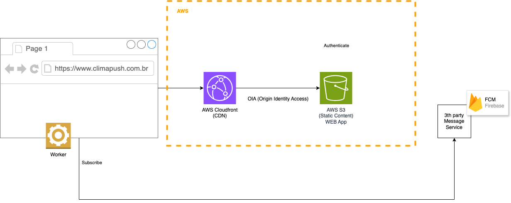

- [Test](#test)
  - [Tasks](#tasks)
  - [Arquitetura](#arquitetura)
    - [Web App](#web-app)
    - [API](#api)
    - [Notificações](#notificações)
    - [Notificações - Como escalar](#notificações---como-escalar)
      - [Componentes principais](#componentes-principais)
    - [Devops](#devops)

# Test

## Tasks

- [x] Setup AWS Cloud IaC: Cloudformation (Cloudfront, S3, Cognito, DynamoDB)
- [x] Setup AWS API: SAM (API Gateway, Lambda Functions, Schedule)
- [x] Setup Firebase Cloud Message: (FCM Key, FCM VAPDKEY, Web App Client)
- [x] Setup React Web App
- [x] Web Login
- [x] Web Forgot Password
- [x] Web Logout
- [x] Web Home
- [x] Web Notification Integration
- [x] Web Notification Layout Foreground
- [x] Web Notification Layout Background
- [x] Web Form Optout
- [x] API Documentation (Swagger)
- [x] API Create User
- [x] API Update User Device Token
- [x] API Update User Optout
- [x] API Schedule Find Users to Send Notification
- [ ] API Schedule Find Users to Send Email
- [x] API Integrate Climate API
- [x] API Integrate Climate API - Fallback
- [ ] API Integrate Climate API - Circuit Breaker
- [ ] Performance test
- [x] CI/CD

## Arquitetura

Arquitetura alto nível utilizando o provedor de Cloud AWS.

Optar pela AWS como provedor de cloud e pela arquitetura Serverless é uma decisão estratégica inicial do projeto, visando um produto mínimo viável. A AWS oferece uma infraestrutura robusta e segura, com uma ampla gama de serviços que facilitam a escalabilidade e garantem alta disponibilidade. A arquitetura Serverless complementa essa escolha ao permitir que a aplicação escale automaticamente, reduza custos e aumente a agilidade de desenvolvimento, tudo isso enquanto minimiza a complexidade operacional.

Esses fatores combinados fazem da AWS e do Serverless uma escolha sólida para construir aplicações modernas, escaláveis e resilientes.

### Web App

Optar por uma aplicação web estática utilizando React, implantada no AWS S3 e distribuída pelo AWS CloudFront, traz inúmeros benefícios:

* Desempenho: S3 e CloudFront juntos garantem uma aplicação com baixa latência e alto desempenho global.
* Segurança: Políticas de acesso do S3, SSL/TLS do CloudFront e proteção de conteúdo garantem a segurança dos dados e da aplicação.
* Custo-Efetividade: A abordagem estática elimina a necessidade de servidores dinâmicos, reduzindo custos operacionais. S3 e CloudFront são soluções escaláveis e de baixo custo.
* Facilidade de Manutenção: Menos complexidade na infraestrutura e ferramentas de automação facilitam a implantação e manutenção contínua da aplicação.

Essa arquitetura é uma escolha sólida para garantir uma experiência de usuário excelente, com alta disponibilidade e desempenho, enquanto mantém os custos e a complexidade operacional sob controle.

### API

Utilizar AWS SAM para a construção da API e Node.js para o desenvolvimento dos casos de uso oferece uma combinação de ferramentas e práticas que garantem:

* Escalabilidade e Resiliência: SAM entrega API Gateway e Lambda que juntos fornecem uma infraestrutura que pode escalar automaticamente para atender à demanda, garantindo alta disponibilidade e desempenho.
* Facilidade de Desenvolvimento e Manutenção: A definição de infraestrutura como código do SAM acelera o desenvolvimento e simplifica a manutenção da aplicação.
* Integração com o Ecossistema AWS: SAM facilita a integração com outros serviços AWS, enquanto Node.js possui uma comunidade que oferece bibliotecas que complementam essa integração.
* Eficiência de Custos: A arquitetura serverless, garante que você só pague pelo uso efetivo dos recursos, reduzindo os custos operacionais.

Esses fatores combinados fazem do AWS SAM e do Node.js uma escolha sólida para construir APIs escaláveis, eficientes e fáceis de manter na nuvem.

### Notificações

Integrar AWS SNS Mobile Push com Firebase Cloud Messaging para enviar notificações push para web apps oferece uma solução escalável que combina o melhor dos dois serviços:

* Escalabilidade e Confiabilidade: SNS garante a escalabilidade e a entrega confiável das mensagens, enquanto FCM garante a entrega eficiente aos dispositivos finais.
* Facilidade de Uso e Integração: Ambas as plataformas oferecem APIs e ferramentas que facilitam a integração e o desenvolvimento, permitindo que você implemente notificações push rapidamente.
* Cobertura Abrangente e Engajamento: FCM oferece suporte a múltiplas plataformas, permitindo alcançar uma base de usuários diversificada e aumentar o engajamento através de notificações.
* Custo-Efetividade: Utilizar serviços gerenciados como SNS e FCM permite que você foque no desenvolvimento da sua aplicação, deixando a gestão da infraestrutura e da entrega de mensagens para serviços especializados.

Esses fatores fazem da integração entre AWS SNS e FCM uma escolha robusta e eficiente para enviar notificações push para web apps garantindo desempenho.

### Notificações - Como escalar

Esta arquitetura foi desenhada para escalar automaticamente quando o número de usuários aumentar, com o objetivo de enviar notificações push de maneira eficiente.

#### Componentes principais

* AWS SNS (Simple Notification Service - Topic)

  Objetivo: Publicar mensagens para cada usuário identificado, onde cada mensagem contém os dados de um usuário.

  Vantagens: O SNS é projetado para escalar automaticamente e distribuir mensagens para um grande número de assinantes, o que é ideal para notificações em massa.

* AWS SQS (Simple Queue Service)

  Objetivo: Garantir que as mensagens publicadas pelo SNS sejam processadas de maneira confiável, além de permitir diferentes tipos de consumidores (outros casos de usos).

  Vantagens: SQS garante a entrega de mensagens com alta disponibilidade, desacoplando o processamento de mensagens para "suavizar" picos de tráfego.

* AWS Lambda (Send Notification)

  Objetivo: Consumir mensagens do SQS, obter dados do clima de um serviço externo (como o CPTEC), e enviar notificações push para os dispositivos dos usuários.

  Vantagens: Separar a lógica de obtenção de usuários da lógica de envio de notificações melhorando a escalabilidade do sistema.

### Devops

Leia o [README.md](iac/README.md) do módulo de infraestrutura como código.