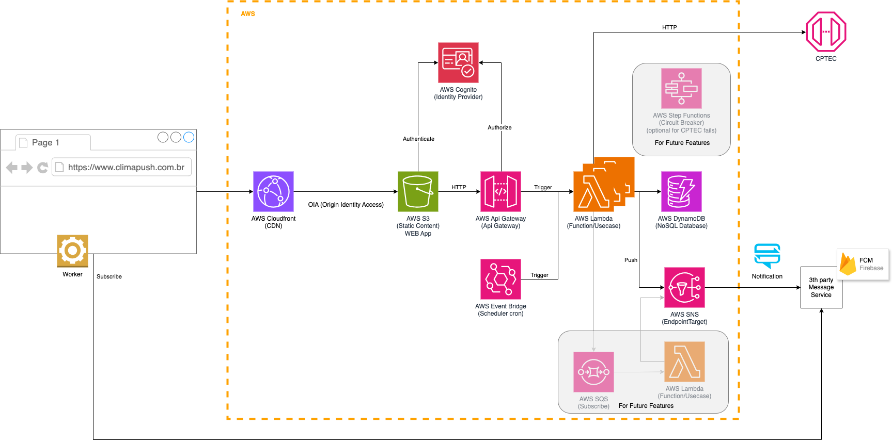

# IaC

- [IaC](#iac)
  - [Arch](#arch)
  - [Deploy Cloud](#deploy-cloud)
    - [Only One (Nested Stack)](#only-one-nested-stack)
    - [One by One](#one-by-one)
      - [Stack Auth](#stack-auth)
      - [Stacks for Storage](#stacks-for-storage)
        - [Backend](#backend)
        - [Frontend](#frontend)
      - [Stacks for CDN](#stacks-for-cdn)
        - [Frontend](#frontend-1)
      - [Stack Database](#stack-database)
  - [Deploy Frontend](#deploy-frontend)
  - [Deploy Backend](#deploy-backend)

## Arch



## Deploy Cloud

É possível criar a Stack climapush usando apenas um passo (nested stack), ou de mandeira separada com stacks únicas.

Definir variáveis para auxiliar os próximos comandos:

```shell
ENVIRONMENT_NAME=dev
APPLICATION_NAME=climapush
PROFILE="${ENVIRONMENT_NAME}-${APPLICATION_NAME}"
```

```shell
aws configure --profile $PROFILE
```

```shell
AWS_REGION=$(aws configure get region --profile $PROFILE)
```

### Only One (Nested Stack)

Crie um bucket no S3 para subir os arquivos das Stacks do Cloudformation.

```shell
aws s3api create-bucket \
--bucket "${ENVIRONMENT_NAME}-${APPLICATION_NAME}" \
--region $AWS_REGION \
--create-bucket-configuration "LocationConstraint=${AWS_REGION}" \
--profile $PROFILE
```

Copie os arquivos

```shell
cd aws/cloudformation
aws s3 sync . "s3://${ENVIRONMENT_NAME}-${APPLICATION_NAME}/" --profile $PROFILE
```

Defina algunas parâmetros para o deploy da Stack.

```shell
PARAMETERS_JSON="[
  { \""ParameterKey\"" : \""EnvironmentName\"", \""ParameterValue\"" : \""${ENVIRONMENT_NAME}\""}
]"
```

Cria a Stack no Cloudformation

```shell
aws cloudformation create-stack \
--stack-name "${ENVIRONMENT_NAME}-${APPLICATION_NAME}" \
--template-url "https://${ENVIRONMENT_NAME}-${APPLICATION_NAME}.s3.${AWS_REGION}.amazonaws.com/Stack.yml" \
--parameters $PARAMETERS_JSON \
--capabilities CAPABILITY_IAM \
--profile $PROFILE
```

Atualize a Stack no Cloudformation

```shell
aws cloudformation update-stack \
--stack-name "${ENVIRONMENT_NAME}-${APPLICATION_NAME}" \
--template-url "https://${ENVIRONMENT_NAME}-${APPLICATION_NAME}.s3.${AWS_REGION}.amazonaws.com/Stack.yml" \
--parameters $PARAMETERS_JSON \
--capabilities CAPABILITY_IAM \
--profile $PROFILE
```

**IMPORTANT:** IF STACK HAS BEEN CREATED BY NESTED STACK, ONLY UPDATE BY PARENT (Stack.yml)

### One by One

Agora como outra alternativa, é possível criar cada stack separadamente.

#### Stack Auth

```shell
cd iac
aws cloudformation create-stack \
--stack-name "${ENVIRONMENT_NAME}-${APPLICATION_NAME}-auth" \
--template-body file://aws/cloudformation/StackAuth.yml \
--parameters "ParameterKey=EnvironmentName,ParameterValue=${ENVIRONMENT_NAME}" \
--profile $PROFILE \
--capabilities CAPABILITY_NAMED_IAM
```

#### Stacks for Storage

##### Backend

```shell
aws cloudformation create-stack \
--stack-name "${ENVIRONMENT_NAME}-${APPLICATION_NAME}-backend" \
--template-body file://aws/cloudformation/StackStorageBackend.yml \
--parameters "ParameterKey=EnvironmentName,ParameterValue=${ENVIRONMENT_NAME}" \
--profile $PROFILE \
--capabilities CAPABILITY_NAMED_IAM
```

```shell
aws cloudformation wait stack-create-complete \
--stack-name "${ENVIRONMENT_NAME}-${APPLICATION_NAME}-backend" \
--profile $PROFILE
```

##### Frontend

```shell
aws cloudformation create-stack \
--stack-name "${ENVIRONMENT_NAME}-${APPLICATION_NAME}-frontend" \
--template-body file://aws/cloudformation/StackStorageFrontend.yml \
--parameters "ParameterKey=EnvironmentName,ParameterValue=${ENVIRONMENT_NAME}" \
--profile $PROFILE \
--capabilities CAPABILITY_NAMED_IAM
```

```shell
aws cloudformation wait stack-create-complete \
--stack-name "${ENVIRONMENT_NAME}-${APPLICATION_NAME}-frontend" \
--profile $PROFILE
```

#### Stacks for CDN

##### Frontend

```shell
aws cloudformation create-stack \
--stack-name "${ENVIRONMENT_NAME}-${APPLICATION_NAME}-frontend-cdn" \
--template-body file://aws/cloudformation/StackCdnFrontend.yml \
--parameters "ParameterKey=EnvironmentName,ParameterValue=${ENVIRONMENT_NAME}" \
--profile $PROFILE \
--capabilities CAPABILITY_NAMED_IAM
```

```shell
aws cloudformation wait stack-create-complete \
--stack-name "${ENVIRONMENT_NAME}-${APPLICATION_NAME}-frontend-cdn" \
--profile $PROFILE
```

#### Stack Database

```shell
aws cloudformation create-stack \
--stack-name "${ENVIRONMENT_NAME}-${APPLICATION_NAME}-database" \
--template-body file://aws/cloudformation/StackDatabase.yml \
--parameters "ParameterKey=EnvironmentName,ParameterValue=${ENVIRONMENT_NAME}" \
--profile $PROFILE \
--capabilities CAPABILITY_NAMED_IAM
```

```shell
aws cloudformation wait stack-create-complete \
--stack-name "${ENVIRONMENT_NAME}-${APPLICATION_NAME}-database" \
--profile $PROFILE
```

## Deploy Frontend

Como realizar o deploy do Web App.

```shell
FRONTEND_PATH="../frontend"
```

Build static website

```shell
cd $FRONTEND_PATH
npm run build
```

Subir os artefatos para o bucket S3

```shell
AWS_STORAGE_STACK_FRONTEND_BUCKET_NAME=$(aws cloudformation describe-stacks --query "Stacks[?starts_with(StackName,\`${ENVIRONMENT_NAME}-${APPLICATION_NAME}-StackStorageFrontend\`)][].Outputs[?OutputKey=='FrontendStorageName'].OutputValue" --output text --profile $PROFILE)
aws s3 sync "${FRONTEND_PATH}/build" s3://${AWS_STORAGE_STACK_FRONTEND_BUCKET_NAME}/ --delete --profile $PROFILE
```

Invalidar o CDN para atualizar o Web App na Cloud

```shell
AWS_CDN_STACK_DISTRIBUTION_ID=$(aws cloudformation describe-stacks --query "Stacks[?starts_with(StackName,\`${ENVIRONMENT_NAME}-${APPLICATION_NAME}-StackCdnFrontend\`)][].Outputs[?OutputKey=='WebCloudFrontDistributionId'].OutputValue" --output text --profile $PROFILE)
```

```shell
aws cloudfront create-invalidation \
--distribution-id $AWS_CDN_STACK_DISTRIBUTION_ID \
--paths "/*" \
--profile $PROFILE
```

## Deploy Backend

Siga os passos do [README.md](../api/README.md) da API.
